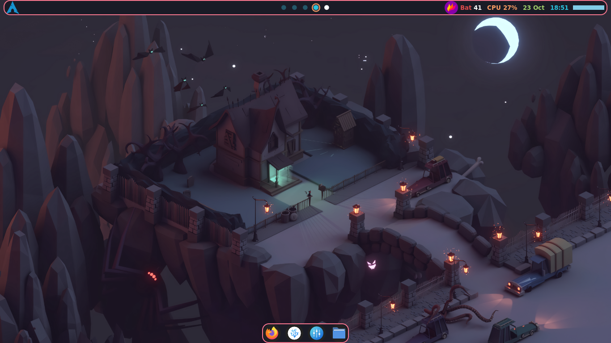
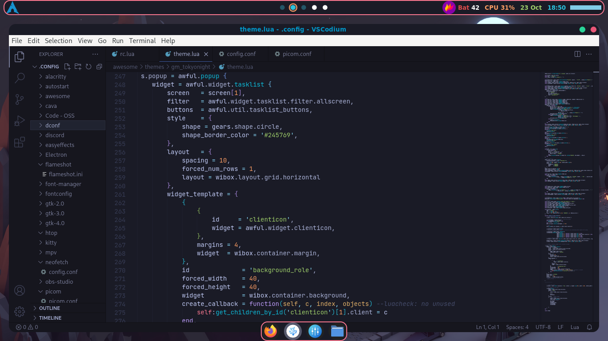
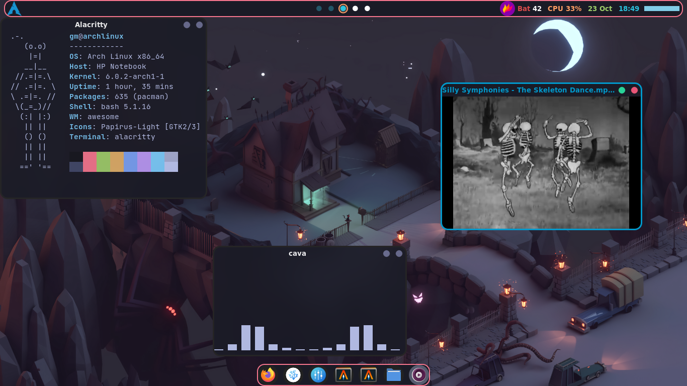

# Dotfiles
Dotfiles for wm and application I use

# Tokyonight rice  WIP

### Awesome WM




# Setup - Arch

1. Install window manager
    
    ``` shell
    # Awesome
    sudo pacman -S awesomewm

2. Install softwares

    ```shell
   
    sudo pacman -S rofi brightnessctl playerctl alsa-utils papirus-icon-theme t network-manager-applet 

    yay -S picom-ibhagwan-git  cava 
   ```

3. Themes

    - [Papirus - Icon theme](https://github.com/PapirusDevelopmentTeam/papirus-icon-theme)

4. Dependencies


   Make sure to satisfy the dependencies of lain and free desktop


5. Theme

    Tokyonight theme for alacritty
     ```shell
            # TokyoNight night Alacritty Colors
            colors:
            # Default colors
            primary:
                background: '0x1a1b26'
                foreground: '0xc0caf5'

            # Normal colors
            normal:
                black:   '0x15161e'
                red:     '0xf7768e'
                green:   '0x9ece6a'
                yellow:  '0xe0af68'
                blue:    '0x7aa2f7'
                magenta: '0xbb9af7'
                cyan:    '0x7dcfff'
                white:   '0xa9b1d6'

            # Bright colors
            bright:
                black:   '0x414868'
                red:     '0xf7768e'
                green:   '0x9ece6a'
                yellow:  '0xe0af68'
                blue:    '0x7aa2f7'
                magenta: '0xbb9af7'
                cyan:    '0x7dcfff'
                white:   '0xc0caf5'

            indexed_colors:
                - { index: 16, color: '0xff9e64' }
                - { index: 17, color: '0xdb4b4b' }
    ```
    
  
